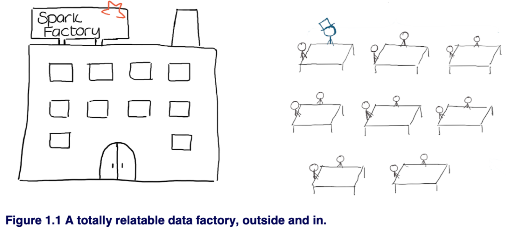
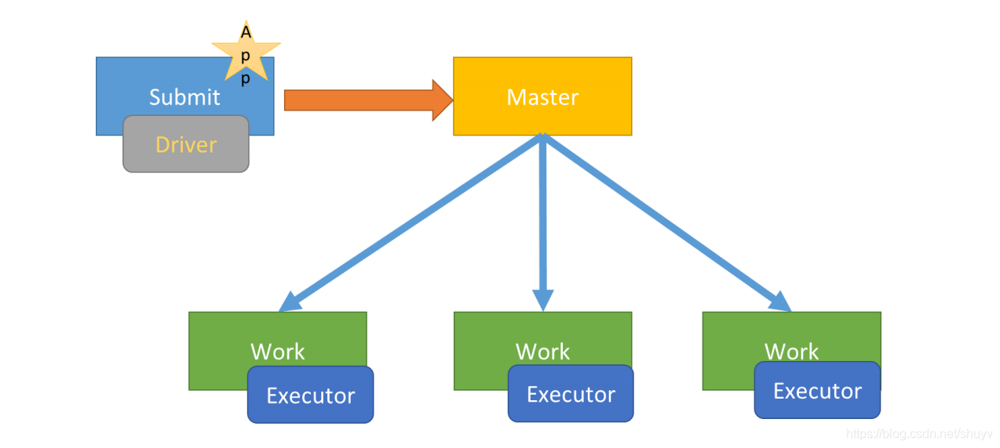
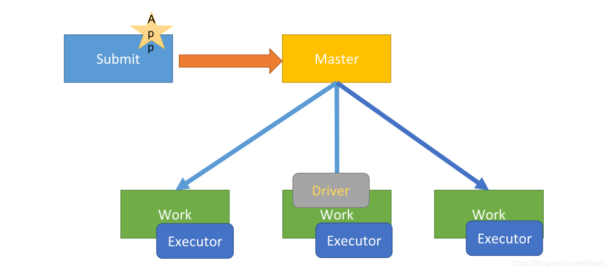

# Big Data

Reference:

1.   Data Analysis with Python and PySpark,  ISBN: 9781617297205

## Glossary

1.   RDD
     -   Resilient Distributed Dataset
     -   不可变的分布式对象集合
     -   After Spark 2.0, RDDs are replaced by Dataset, which is strongly-typed like an RDD, but with richer optimizations under the hood. We highly recommend you to switch to use Dataset, which has better performance than RDD.
2.   Hadoop 三个组成部分
     -   MapReduce: 分布式运算程序的编程框架
     -   HDFS: Hadoop Distributed File System，Hadoop 分布式文件系统
     -   YARN: Yet Another Resource Negotiator，资源调度平台
3.   ETL
     -   Extract-Transform-Load
     -   是一个数据流 pipeline 的控制技术
     -   是将大量的原始数据经过提取 extract、转换 transform、加载 load 到目标存储数据仓库的过程
4.   Data Lakes 数据湖，Big Data Warehouse 大数据仓库
5.   UDF: User Defined Functions，PySpark 自定义函数

##  Spark & PySpark

### Definition

1.   Spark is a unified analytics engine for large-scale data processing. 用于大规模数据处理的统一分析引擎
2.   Scaling out instead of scaling up. 将数据 split 到2个中型计算机，而不是使用1个大型计算机
3.   Spark itself is coded in Scala. Python codes have to be translated to and from JVM instructions.
4.   代替 Hadoop 中的 MapReduce 框架

Data Factory:

1.   在 Spark cluster 中每个 workbench / computer 会分配一些 workers / executors
2.   这些 workers / executors 中有一个 master，对程序的效率很重要

Spark 算子可以被归为2类：

1.   Actions (IO)

     -   via the `show` and `write` methods

     -   Printing information on the screen

     -   Writing data to a hard drive or cloud bucket

2.   Transformations (Lazy)

     -   Adding a column to a table
     -   Performing an aggregation according to certain keys
     -   Computing summary statistics on a data set
     -   Training a Machine Learning model on some data

3.   Lazy computation model, will take this to the extreme and will avoid performing data work until an action triggers the computation chain. 所有的 Transformations 都是 Lazy 操作，只记录需要进行的转换，并不会马上执行，只有遇到 Actions 操作时才会真正启动计算过程并进行计算。

4.   Reading data, although clearly being I/O, is considered a transformation by Spark.

QuickStart: <https://spark.apache.org/docs/latest/quick-start.html>

1.   Install: `brew install openjdk@17 apache-spark`
2.   Spark’s primary abstraction is a distributed collection of items called a Dataset. Datasets can be created from Hadoop InputFormats (such as HDFS files) or by transforming other Datasets. All Datasets in Python are Dataset[Row], and we call it `DataFrame`.
3.   Caching: Spark also supports pulling data sets into a cluster-wide in-memory cache. This is very useful when data is accessed repeatedly, such as when querying a small “hot” dataset or when running an iterative algorithm like PageRank.
4.   

### Cluster Manager

<https://spark.apache.org/docs/latest/cluster-overview.html>

Spark applications run as independent sets of processes on a cluster, coordinated by the `SparkContext` object in your main program (called the *driver program*).

工作原理：

1.   在 cluster 上运行时，`SparkContext` 可以连接到不同类型的 *cluster managers* 上
     -   Cluster Manager 类型：
         -   [Standalone](https://spark.apache.org/docs/latest/spark-standalone.html): Spark’s own standalone cluster manager
         -   [Apache Mesos](https://spark.apache.org/docs/latest/running-on-mesos.html): Deprecated
         -   [Hadoop YARN](https://spark.apache.org/docs/latest/running-on-yarn.html): The resource manager in Hadoop 3
         -   [Kubernetes](https://spark.apache.org/docs/latest/running-on-kubernetes.html): An open-source system for automating deployment, scaling, and management of containerized applications
         
     -   Cluster Manager 作用：Allocate resources across applications
     
     -   Deploy mode:
     
         <https://blog.csdn.net/shuyv/article/details/116569355>
     
         -   In "cluster" mode, the framework launches the driver inside of the cluster.
     
             应用 Driver Program 运行在提交应用 Client 主机上（启动 JVM Process 进程）、
     
             
     
         -   In "client" mode, the submitter launches the driver outside of the cluster.
     
             应用Driver Program运行在集群从节点 Worker 某台机器上
     
             
     
2.   建立连接后，Spark  会获取 executors
     -   Executors 在 cluster 里的 worker nodes 当中
     -   Executors are processes that run computations and store data for your application
     -   Each application gets its own executor processes
     
3.   `SparkContext` 将应用程序代码 (JAR or Python files) 发送给 executors

4.   `SparkContext` 将 *task* 发送给 executors 运行
     -   Each job gets divided into smaller sets of tasks called *stages* that depend on each other (similar to the map and reduce stages in MapReduce)

### Example

<https://spark.apache.org/examples.html>

## PySpark API

### sql.Column

A column in a DataFrame.

### sql.functions.

`from pyspark.sql import functions as sf`

1.   `col`

## Hive
